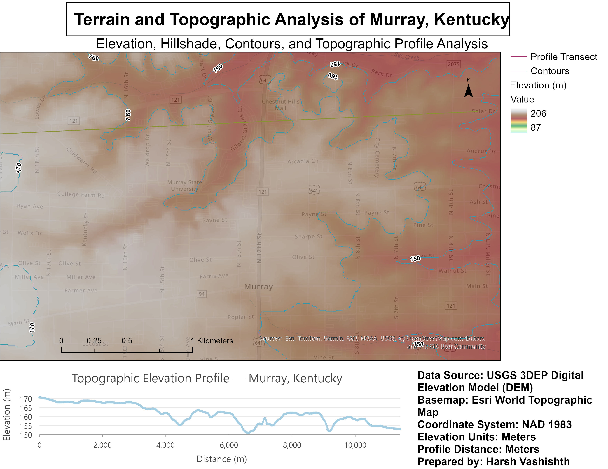

# Terrain and Topographic Analysis of Murray, Kentucky

## Overview

This project presents a GIS-based **terrain and topographic analysis of Murray, Kentucky**, developed using **ArcGIS Pro** and a **USGS 3DEP Digital Elevation Model (DEM)**.

The project demonstrates a complete raster terrain-analysis workflow, including DEM processing, elevation visualization, hillshade generation, slope and aspect analysis, contour generation, and extraction of a topographic elevation profile along a selected transect.

The purpose of this project was to strengthen practical skills in **terrain analysis, raster processing, elevation modeling, spatial analysis, and professional GIS cartography**.

---

## Final Map



*Final terrain and topographic analysis map of Murray, Kentucky, showing elevation, hillshade, contour lines, the selected profile transect, and the corresponding topographic elevation profile.*

---

## Study Area

**Location:** Murray, Kentucky, USA

The study area covers Murray and the surrounding landscape in western Kentucky. The analysis focuses on local variations in terrain and elevation and demonstrates how Digital Elevation Model data can be transformed into useful topographic products for visualization and spatial analysis.

---

## Data Sources

The primary elevation dataset used in this project was obtained from the **USGS 3D Elevation Program (3DEP)**.

| Dataset | Source | Purpose |
|---|---|---|
| Digital Elevation Model (DEM) | USGS 3DEP | Primary elevation dataset |
| World Topographic Map | Esri | Geographic reference and basemap |
| World Hillshade | Esri | Additional terrain reference |

The DEM provided the elevation surface used to derive the terrain-analysis products.

---

## Software and Tools

The project was completed primarily in **ArcGIS Pro**.

Key GIS tools and techniques used include:

- Raster processing
- DEM visualization
- Hillshade analysis
- Slope analysis
- Aspect analysis
- Contour generation
- Raster symbology
- Add Surface Information
- Stack Profile
- Elevation profile charting
- Layer transparency and visualization
- Map layout design
- Project packaging

---

## Methodology

### 1. DEM Preparation

A USGS 3DEP Digital Elevation Model was imported into ArcGIS Pro and used as the primary terrain dataset.

The DEM was inspected and prepared for subsequent terrain-analysis operations.

---

### 2. Elevation Visualization

The DEM was symbolized using a continuous elevation color ramp to visualize differences in terrain elevation across the Murray study area.

The elevation surface ranges approximately from:

- **Minimum elevation:** 87 m
- **Maximum elevation:** 206 m

This visualization provides a clear representation of relatively low- and high-elevation areas within the study region.

---

### 3. Hillshade Analysis

A hillshade raster was generated from the DEM to simulate illumination across the terrain.

The hillshade layer was combined with the colorized elevation surface using transparency to improve the perception of terrain relief while retaining elevation information.

This technique provides a more intuitive three-dimensional appearance of the landscape on a two-dimensional map.

---

### 4. Slope Analysis

A slope raster was generated from the DEM to represent the rate of elevation change across the landscape.

Slope analysis is useful for identifying:

- Relatively flat terrain
- Moderate slopes
- Steeper terrain
- Areas where elevation changes rapidly

Slope information can support applications such as watershed studies, land-use planning, erosion assessment, infrastructure planning, and environmental analysis.

---

### 5. Aspect Analysis

An aspect raster was created to determine the direction that terrain slopes face.

Aspect represents the compass direction of the maximum rate of change in elevation and can be useful in studies involving:

- Solar exposure
- Vegetation patterns
- Soil moisture
- Hydrology
- Ecological processes

---

### 6. Contour Generation

Contour lines were derived from the DEM to provide a traditional representation of terrain elevation.

The contours were displayed over the elevation and hillshade layers to improve interpretation of terrain shape and elevation patterns.

Representative contour elevations visible in the final map include approximately:

**150 m, 160 m, and 170 m.**

---

### 7. Topographic Profile Transect

A profile transect line was created across the study area to examine how elevation changes along a selected path through the terrain.

The transect extends across the Murray area and intersects multiple terrain features.

---

### 8. Surface Information Extraction

Elevation information was extracted from the DEM along the profile line.

Surface information was used to evaluate elevation characteristics along the transect and support development of the final topographic profile.

---

### 9. Stack Profile Analysis

The **Stack Profile** tool was used to sample elevation values from the DEM along the selected profile transect.

The resulting table contains distance and elevation measurements along the profile.

These measurements were then used to generate the elevation profile chart.

---

## Topographic Elevation Profile

The elevation profile illustrates changes in terrain elevation along the selected transect.

The profile shows several areas of gradual elevation change as well as more noticeable depressions and rises along the route.

The chart uses:

- **X-axis:** Distance (m)
- **Y-axis:** Elevation (m)

The profile extends for approximately **11 km** across the selected transect.

---

## Final Map Components

The final cartographic layout contains:

- Colorized elevation surface
- Hillshade visualization
- Contour lines
- Profile transect
- Topographic elevation profile
- Legend
- North arrow
- Scale bar
- Data-source information
- Coordinate-system information
- Map title and subtitle

These elements were combined into a single professional layout designed for GIS portfolio presentation.

---

## Coordinate System and Units

**Horizontal Coordinate System:** NAD 1983

**Elevation Units:** Meters

**Profile Distance Units:** Meters

The project maintains consistent elevation and profile units to allow straightforward interpretation of the terrain-analysis results.

---

## Key Results

The terrain analysis identified noticeable elevation variation across the Murray study area.

The DEM-derived elevation surface ranges from approximately **87 m to 206 m**.

The elevation profile shows that terrain along the selected transect generally varies between approximately **150 m and 170 m**, with several local depressions and rises.

Combining the colorized DEM with hillshade improved visualization of terrain relief, while contour lines provided an additional quantitative representation of elevation.

---

## Skills Demonstrated

This project demonstrates practical experience with:

- ArcGIS Pro
- Digital Elevation Models (DEM)
- USGS 3DEP elevation data
- Raster data processing
- Terrain analysis
- Hillshade generation
- Slope analysis
- Aspect analysis
- Contour generation
- Surface information extraction
- Stack Profile analysis
- Elevation profile creation
- Raster symbology
- Layer transparency
- Spatial data visualization
- Cartographic layout design
- GIS project organization
- Project packaging

---

## Project Workflow

```text
USGS 3DEP DEM
      |
      v
DEM Preparation
      |
      +------------------+
      |                  |
      v                  v
Elevation            Hillshade
Visualization
      |
      +------------------+
      |        |         |
      v        v         v
    Slope    Aspect   Contours
                         |
                         v
                 Profile Transect
                         |
                         v
              Surface Information
                         |
                         v
                  Stack Profile
                         |
                         v
                Elevation Profile
                         |
                         v
               Final Map Layout
```

---

## Repository Structure

```text
Murray-KY-Terrain-Topographic-Analysis/
│
├── README.md
│
├── maps/
│   └── Murray_KY_Terrain_Topographic_Analysis.jpg
│
├── project/
│   └── Murray_KY_Terrain_Analysis.ppkx
│
└── screenshots/
    ├── elevation.jpg
    ├── hillshade.jpg
    ├── slope.jpg
    ├── aspect.jpg
    ├── contours.jpg
    └── elevation_profile.jpg
```

*Repository contents may vary depending on the supporting files included with the project.*

---

## Applications

Terrain-analysis workflows such as this can support a variety of environmental and GIS applications, including:

- Watershed analysis
- Hydrologic modeling
- Flood-risk assessment
- Land-use planning
- Agricultural landscape analysis
- Environmental assessment
- Infrastructure planning
- Erosion and slope assessment
- Habitat and ecological studies

---

## Author

**Harsh Vashishth**

GIS & Remote Sensing | Environmental Science | Earth Science

M.S. Earth & Environmental Sciences  
Murray State University

---

## Project Purpose

This project was developed as a **GIS portfolio project** to demonstrate practical proficiency in terrain analysis using ArcGIS Pro and publicly available USGS elevation data.
